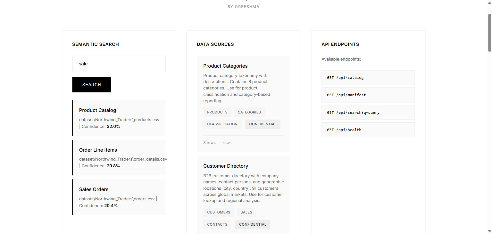
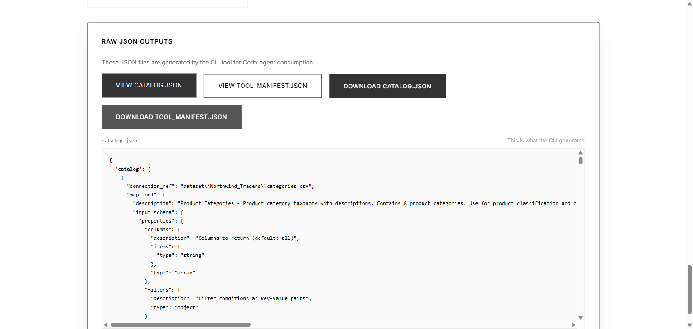

# Cortx Data Catalog & Semantic Layer Builder

A Python CLI tool that ingests data sources, profiles them, sends metadata to an LLM for annotation, and outputs a `catalog.json` plus a ready-to-register MCP tool manifest.

##  Problem Solved

Cortx agents (RAG, MCP tools) currently discover data sources at runtime with no metadata about what they contain, how they're structured, or what business concepts they represent. This tool builds the semantic layer that enables agents to:

- Query intelligently with business context
- Return better results through understanding data relationships  
- Reason about which data source to use for a given query

##  Quick Start

### Prerequisites

- Python 3.10 or higher
- 4GB RAM (8GB recommended)
- 2GB free disk space

### Installation

```bash
# Clone the repository
git clone https://github.com/Greeshmapinku/Cortx-Data-Catalog.git
cd Cortx-Data-Catalog

# Create virtual environment
python -m venv venv

# Activate (Windows PowerShell)
.\venv\Scripts\Activate.ps1

# Activate (Mac/Linux)
source venv/bin/activate

# Install dependencies
pip install -e ".[dev]"
```

### Option 1: Web Dashboard (Recommended for Demo)

```bash
# Start the web dashboard
python app.py

# Open browser to:
http://localhost:5000
```

**Features:**
- Browse 7 Northwind data sources
- Semantic search with confidence scores
- View MCP tool manifests
- Download catalog.json and tool_manifest.json



### Option 2: CLI Tool

```bash
# Set up Groq API key for LLM annotation (optional, free at https://console.groq.com)
$env:GROQ_API_KEY="your-key-here"  # Windows
export GROQ_API_KEY="your-key-here"  # Mac/Linux

# Profile a CSV file
cortx-catalog-gen --source csv --uri ./customers.csv --output catalog.json

# Profile SQLite database
cortx-catalog-gen --source sqlite --uri ./mydata.db --table users

# Profile without LLM (uses fallback annotation - faster)
cortx-catalog-gen --source csv --uri ./data.csv --no-annotate
```

### Outputs

The tool generates exactly what Cortx agents need:

**`catalog.json`** - Semantic catalog with profiles and metadata:
```json
{
  "catalog": [
    {
      "source_id": "csv.customers",
      "source_type": "csv",
      "connection_ref": "dataset/Northwind_Traders/customers.csv",
      "profile": {
        "row_count": 91,
        "columns": [
          {
            "name": "customerID",
            "dtype": "string",
            "null_pct": 0.0,
            "cardinality": 91,
            "sample_values": ["ALFKI", "ANATR"],
            "is_pii": false
          }
        ]
      },
      "semantic": {
        "title": "Customer Directory",
        "description": "B2B customer directory with company names and geographic locations",
        "domain_tags": ["customers", "sales", "contacts"],
        "sensitivity": "confidential",
        "primary_entity": "customer",
        "query_hints": ["filter by country for regional analysis"],
        "likely_join_keys": ["customerID"]
      },
      "mcp_tool": {
        "name": "query_csv_customers",
        "description": "Customer Directory - B2B customer directory... Use when user asks about customer information...",
        "input_schema": { "type": "object", "properties": {...} }
      }
    }
  ]
}
```

**`tool_manifest.json`** - Ready-to-register MCP tools:
```json
{
  "query_csv_customers": {
    "description": "Customer Directory - ... Use when user asks about customer information...",
    "input_schema": { "type": "object", ... },
    "source_id": "csv.customers"
  }
}
```

##  Features

- **Multi-Source Support**: CSV, SQLite, Parquet
- **Deep Profiling**: Cardinality, null rates, type inference, PII detection (5 patterns), date ranges
- **LLM Annotation**: Structured JSON output via Groq API with few-shot examples
- **Semantic Search**: Embeddings for similarity-based catalog search (title + description + query_hints)
- **MCP Manifests**: Agent-legible descriptions with use/avoid guidance

##  Architecture

```
cortx_catalog/
├── cli.py              # CLI entry point (Click)
├── models.py           # Pydantic dataclasses
├── profiler.py         # Data profiling (cardinality, PII, dates)
├── annotator.py        # Groq LLM integration with fallback
├── embedder.py         # sentence-transformers embeddings
├── manifest.py         # MCP manifest generator
├── catalog_builder.py  # Main orchestrator
└── loaders/            # Data source loaders
    ├── csv_loader.py
    ├── sqlite_loader.py
    └── parquet.py
```

##  Testing

```bash
# Run all tests
pytest

# Run with coverage
pytest --cov=cortx_catalog --cov-report=html
```

##  Web Dashboard

A Flask web interface is included for visualizing the catalog:

```bash
python app.py
```

The dashboard provides:
- **Semantic Search**: Find data sources by natural language queries
- **Data Sources**: Browse all sources with descriptions and tags
- **MCP Tool Manifests**: View agent-ready tool descriptions
- **API Endpoints**: Test the REST API
- **Download**: Get catalog.json and tool_manifest.json



##  Assessment Alignment

| Requirement | Implementation |
|-------------|----------------|
| CLI tool `cortx-catalog-gen` | ✅ `src/cortx_catalog/cli.py` |
| Output `catalog.json` | ✅ Generated with full schema |
| Output MCP manifests | ✅ `tool_manifest.json` |
| Profile: cardinality, null%, PII, dates | ✅ All implemented |
| LLM: structured JSON, query hints | ✅ Groq API with fallback |
| Embedding: semantic block search | ✅ title+description+query_hints |
| MCP: use/avoid guidance | ✅ Agent-legible descriptions |
| Code quality: separation, types | ✅ 12 modules, Pydantic models |

## 🛠️ Technology Stack

- **CLI**: Click
- **Web**: Flask, Flask-CORS
- **Data**: Pandas, SQLAlchemy, PyArrow
- **LLM**: Groq API (structured JSON mode)
- **Embeddings**: sentence-transformers (local, free)
- **Models**: Pydantic v2

##  Environment Variables

```bash
GROQ_API_KEY=your_groq_api_key      # Optional: For LLM annotation
PORT=5000                           # Optional: Change web server port
```

##  Quick Commands

| Task | Command |
|------|---------|
| Start web dashboard | `python app.py` |
| Run CLI demo | `cortx-catalog-gen --demo` |
| Run tests | `pytest` |
| Stop server | `CTRL + C` |

##  License

MIT License - See LICENSE file for details.

---

**Built by Greeshma** for Cortx Assessment
