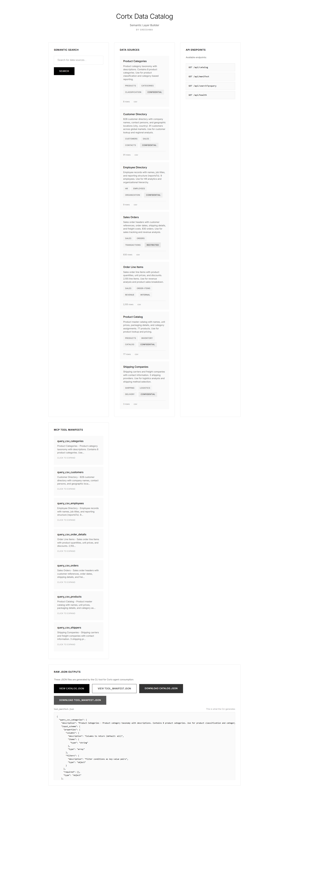

# Cortx Data Catalog & Semantic Layer Builder

A Python CLI tool that ingests data sources, profiles them, sends metadata to an LLM for annotation, and outputs a `catalog.json` plus a ready-to-register MCP tool manifest.

## 🎯 Problem Solved

Cortx agents (RAG, MCP tools) currently discover data sources at runtime with no metadata about what they contain, how they're structured, or what business concepts they represent. This tool builds the semantic layer that enables agents to:

- Query intelligently with business context
- Return better results through understanding data relationships  
- Reason about which data source to use for a given query

## 🚀 Quick Start (CLI)

### Installation

```bash
# Clone the repository
git clone <repo-url>
cd cortx-catalog-gen

# Create virtual environment
python -m venv venv
source venv/bin/activate  # Windows: venv\Scripts\activate

# Install dependencies
pip install -e ".[dev]"
```

### Generate Catalog from Data Sources

```bash
# Set up Groq API key for LLM annotation (free at https://console.groq.com)
export GROQ_API_KEY="your-key-here"

# Profile a CSV file
cortx-catalog-gen --source csv --uri ./customers.csv --output catalog.json

# Profile SQLite database
cortx-catalog-gen --source sqlite --uri ./mydata.db --table users

# Profile without LLM (uses fallback annotation - faster)
cortx-catalog-gen --source csv --uri ./data.csv --no-annotate
```

### Outputs

The CLI generates exactly what Cortx agents need:

**`catalog.json`** - Semantic catalog with profiles and metadata:
```json
{
  "catalog": [
    {
      "source_id": "csv.customers",
      "source_type": "csv",
      "profile": {
        "row_count": 91,
        "columns": [
          {
            "name": "customerID",
            "dtype": "string",
            "null_pct": 0.0,
            "cardinality": 91,
            "sample_values": ["ALFKI", "ANATR"],
            "is_pii": false
          }
        ]
      },
      "semantic": {
        "title": "Customer Directory",
        "description": "B2B customer directory with company names and geographic locations",
        "domain_tags": ["customers", "sales", "contacts"],
        "sensitivity": "confidential",
        "primary_entity": "customer",
        "query_hints": ["filter by country for regional analysis"],
        "likely_join_keys": ["customerID"]
      },
      "mcp_tool": {
        "name": "query_csv_customers",
        "description": "Customer Directory - B2B customer directory... Use when user asks about customer information...",
        "input_schema": { "type": "object", "properties": {...} }
      }
    }
  ]
}
```

**`tool_manifest.json`** - Ready-to-register MCP tools:
```json
{
  "query_csv_customers": {
    "description": "Customer Directory - ... Use when user asks about customer information...",
    "input_schema": { "type": "object", ... },
    "source_id": "csv.customers"
  }
}
```

## ✨ Features

- **📊 Multi-Source Support**: CSV, SQLite, Parquet (PostgreSQL/MySQL stubs ready)
- **🔍 Deep Profiling**: Cardinality, null rates, type inference, PII detection (5 patterns), date ranges
- **🤖 LLM Annotation**: Structured JSON output via Groq API with few-shot examples
- **🔎 Semantic Search**: Embeddings for similarity-based catalog search (title + description + query_hints)
- **🛠️ MCP Manifests**: Agent-legible descriptions with use/avoid guidance

## 🏗️ Architecture

```
cortx_catalog/
├── cli.py              # CLI entry point (Click)
├── models.py           # Pydantic dataclasses
├── profiler.py         # Data profiling (cardinality, PII, dates)
├── annotator.py        # Groq LLM integration with fallback
├── embedder.py         # sentence-transformers embeddings
├── manifest.py         # MCP manifest generator
├── catalog_builder.py  # Main orchestrator
└── loaders/            # Data source loaders
    ├── csv_loader.py
    ├── sqlite_loader.py
    └── parquet.py
```

## 🧪 Testing

```bash
# Run all tests
pytest

# Run with coverage
pytest --cov=cortx_catalog --cov-report=html

# Test semantic search
python -c "
from cortx_catalog.embedder import Embedder
from cortx_catalog.models import SemanticData

e = Embedder()
# Results show cosine similarity scores 0-1
"
```

## 🌐 Optional Web Demo

A Flask web interface is included for visualizing the catalog during development/demo:

```bash
# Generate catalog first
cortx-catalog-gen --source csv --uri ./data.csv

# Run web demo
python app.py
```



**Note:** The web UI is for visualization only. The CLI tool (`cortx-catalog-gen`) is the primary deliverable that generates the JSON outputs Cortx agents consume.

## 📊 Assessment Alignment

| Requirement | Implementation |
|-------------|----------------|
| CLI tool `cortx-catalog-gen` | ✅ `src/cortx_catalog/cli.py` |
| Output `catalog.json` | ✅ Generated with full schema |
| Output MCP manifests | ✅ `tool_manifest.json` |
| Profile: cardinality, null%, PII, dates | ✅ All implemented |
| LLM: structured JSON, query hints | ✅ Groq API with fallback |
| Embedding: semantic block search | ✅ title+description+query_hints |
| MCP: use/avoid guidance | ✅ Agent-legible descriptions |
| Code quality: separation, types | ✅ 12 modules, Pydantic models |

## 🛠️ Technology Stack

- **CLI**: Click
- **Data**: Pandas, SQLAlchemy, PyArrow
- **LLM**: Groq API (structured JSON mode)
- **Embeddings**: sentence-transformers (local, free)
- **Models**: Pydantic v2

## 📝 Environment Variables

```bash
GROQ_API_KEY=your_groq_api_key      # Required for LLM annotation
CORTX_LOG_LEVEL=INFO                # Optional: DEBUG, INFO, WARNING
```

## 📄 License

MIT License - See LICENSE file for details.
